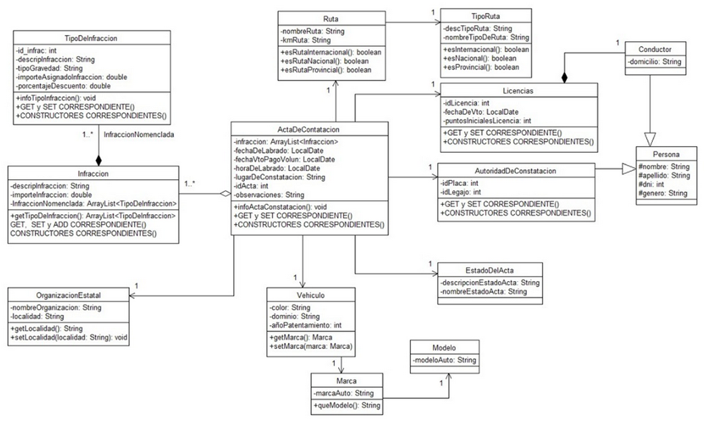

# Sistema de Infracciones Viales

Sistema web para la gestión y registro de actas de constatación de infracciones viales. Desarrollado con Spring Boot en el backend y HTML/CSS/JavaScript con Bootstrap en el frontend.

---

## Tecnologías utilizadas

**Backend**
- Java 17
- Spring Boot
- Spring Security
- Spring Data JPA
- Hibernate 7
- MySQL 8
- Lombok

**Frontend**
- HTML5 / CSS3 / JavaScript (Vanilla)
- Bootstrap 5.3.3
- Bootstrap Icons 1.11.3

**Herramientas**
- IntelliJ IDEA
- Gradle
- MySQL Workbench

---

## Arquitectura

El proyecto sigue una arquitectura en capas:

```
entities/     → Clases JPA que mapean las tablas de la base de datos
repositories/ → Interfaces que extienden JpaRepository para acceso a datos
services/     → Lógica de negocio (interfaces + implementaciones)
dto/          → Data Transfer Objects — objetos que expone la API
mapper/       → Conversión entre entidades y DTOs
controllers/  → Endpoints REST
security/     → Configuración de Spring Security y autenticación
```

El frontend es estático (`src/main/resources/static/`) y consume la API REST mediante `fetch`. No utiliza Thymeleaf ni ningún motor de plantillas.

---
## Diagrama UML



---

## Requisitos previos

- Java 17 o superior
- MySQL 8
- IntelliJ IDEA (recomendado)
- Gradle 8.14 o superior (el wrapper lo descarga automáticamente)

---

## Configuración de la base de datos

Crear la base de datos en MySQL antes de levantar la aplicación:

```sql
CREATE DATABASE db_infracciones_spring;
```

Las tablas se crean automáticamente al levantar la aplicación gracias a `spring.jpa.hibernate.ddl-auto=update`.

Los datos iniciales (roles, usuarios, marcas, modelos, rutas, organizaciones, estados y tipos de infracción) se insertan automáticamente desde `src/main/resources/data.sql`.

---

## Configuración de la aplicación

El archivo de configuración se encuentra en:

```
src/main/resources/application.properties
```

Verificar que las credenciales de MySQL sean correctas:

```properties
spring.datasource.url=jdbc:mysql://localhost:3306/db_infracciones_spring?useUnicode=true&useJDBCCompliantTimezoneShift=true&useLegacyDatetimeCode=false&serverTimezone=UTC
spring.datasource.username=root
spring.datasource.password=root
server.port=9000
```

Modificar `username` y `password` según la configuración local de MySQL.

---

## Cómo levantar el proyecto

1. Clonar o descomprimir el proyecto
2. Abrir en IntelliJ IDEA → **File → Open** → seleccionar la carpeta del proyecto
3. Hacer clic en **Trust Project** cuando IntelliJ lo solicite
4. Esperar que Gradle descargue las dependencias (Gradle Refresh)
5. Crear la base de datos en MySQL: `CREATE DATABASE db_infracciones_spring;`
6. Ejecutar la clase `InfraccionesApplication.java`
7. Abrir el navegador en `http://localhost:9000`

---

## Credenciales de acceso

| Usuario | Contraseña | Rol |
|---|---|---|
| admin | admin123 | Administrador |
| autoridad1 | admin123 | Autoridad |

---

## Roles y permisos

### Administrador
- Acceso total al sistema
- Puede crear, editar y eliminar cualquier registro
- Acceso a Autoridades y Tablas Auxiliares
- Puede eliminar actas, conductores y vehículos

### Autoridad de Constatación
- Puede crear nuevas actas de constatación
- Puede registrar nuevos conductores y vehículos
- Puede agregar marcas, modelos, rutas y tipos de infracción no registrados
- **No puede** editar ni eliminar registros existentes
- **No puede** acceder a la sección de Autoridades ni Tablas Auxiliares
- Al ingresar, su sección de autoridad se autocompleta automáticamente según la cuenta

---

## Funcionalidades principales

### Nueva Acta de Constatación
- Búsqueda de autoridad por número de legajo (autocompletado si el usuario tiene autoridad ligada)
- Búsqueda de conductor por DNI — si no existe permite registrarlo en el momento
- Búsqueda de vehículo por dominio — si no existe permite registrarlo en el momento
- Posibilidad de agregar marcas, modelos, rutas y tipos de infracción nuevos desde el formulario
- Ruta opcional — permite indicar si la infracción ocurrió en una ruta registrada o en un lugar libre
- Múltiples infracciones por acta
- Estado del acta se asigna automáticamente como **Pendiente**
- Validación de campos obligatorios antes de guardar

### Gestión de Actas
- Listado de todas las actas con estado, autoridad, conductor y vehículo
- Estados: Pendiente, Pagada, Vencida

### Gestión de Conductores
- Listado, creación y edición (solo ADMIN)
- Búsqueda por DNI

### Gestión de Vehículos
- Listado, creación y edición (solo ADMIN)
- Búsqueda por dominio

### Gestión de Autoridades (solo ADMIN)
- Listado completo de autoridades habilitadas
- Creación, edición y eliminación

### Tablas Auxiliares (solo ADMIN)
- Marcas y Modelos de vehículos
- Tipos de Ruta y Rutas
- Organizaciones Estatales
- Estados del Acta
- Tipos de Infracción

---

## Estructura del proyecto

```
infracciones_spring/
├── docs/
│   └── img.png 
├── src/
│   ├── main/
│   │   ├── java/com/example/infracciones/
│   │   │   ├── controllers/       → Endpoints REST
│   │   │   ├── dto/               → Data Transfer Objects
│   │   │   ├── entities/          → Entidades JPA
│   │   │   ├── mapper/            → Conversión entidad ↔ DTO
│   │   │   ├── repositories/      → Acceso a datos
│   │   │   ├── security/          → Spring Security
│   │   │   └── services/          → Lógica de negocio
│   │   └── resources/
│   │       ├── static/
│   │       │   ├── css/           → Estilos (styles.css)
│   │       │   ├── js/            → JavaScript por página
│   │       │   ├── pages/         → Páginas HTML internas
│   │       │   └── index.html     → Menú principal
│   │       ├── application.properties
│   │       └── data.sql           → Datos iniciales
├── build.gradle
└── settings.gradle
```

---

## Autor

**Roberto Ezequiel Vildoza**  
Instituto Tecnologico Universitario (ITU) — 2026
